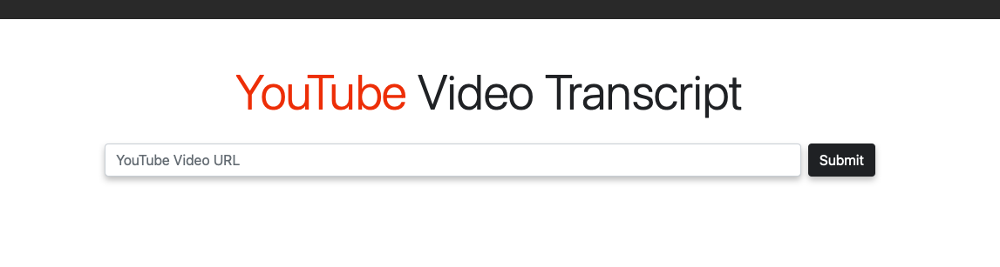
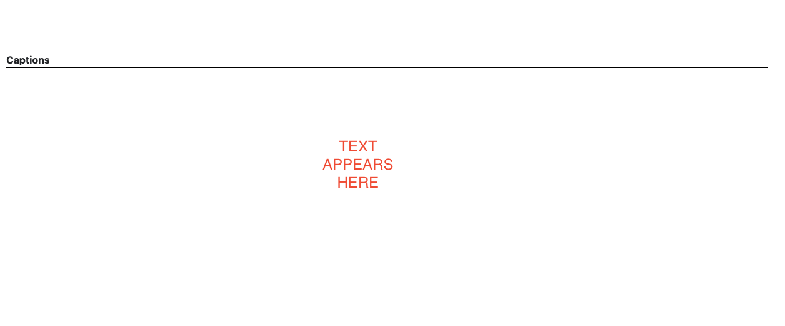

# UText

## Youtube Video Transcriptalizer

This site is intended to be used as a way for a video from Youtube.com to be read in situations where watching a video is impossible or not desired.

## Using The Site

Using the site is simple.

* Enter the URL of a YouTube video in the search bar.

* Press the "Submit" button

* Read On!!

## Getting Started

* Clone or Pull this Repo to make sure you are up to date.

* create a virtual enviornment
    1. *python3 -m venv env*
    2. *source env/bin/activate*

* install requirements
    1. *pip3 install -r requirements.txt*

* add .env file following format of .env.example
    1. Create a file named **.env** (this will be ignored by git for security)
    2. Format the contents of the new file following .env

* to run server type *python3 main.py*
